# Monitoring and Alerting with CloudWatch 

## **1. Creating an AMI for auto scaling** 
•	create an AMI from the existing Web Server 1 Instance  
•	In the left navigation pane, locate the Instances section, and choose Instances. 
•	From the Actions dropdown list, choose Image and templates Create image, and then configure the following. 

  
  
---

## **2. Creating a load Balancer** 

•	In the left navigation pane, locate the Load Balancing section, and choose Load Balancers 
•	In the Load balancer types section, for Application Load Balancer, choose Create. 
•	Select Application load balancer 

   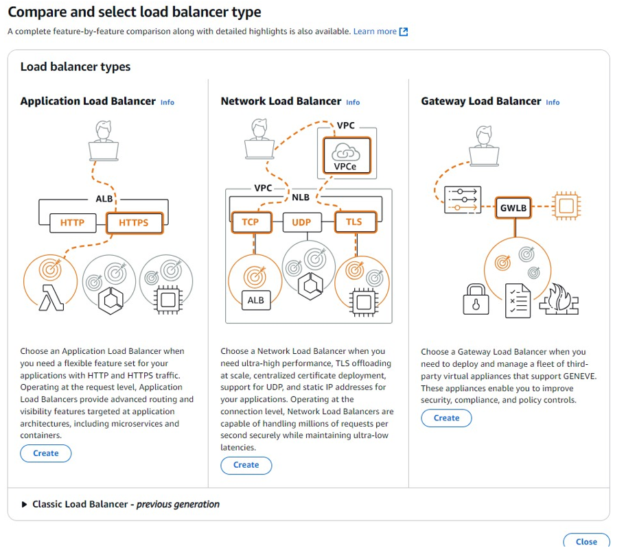
   
•	Map network to the VPC you create with private and public subnets and select two public subnets  
•	Select at least two Availability Zones and a subnet for each zone. A load balancer node will be placed in each selected zone and will automatically scale in response to traffic. The load balancer routes traffic to targets in the selected Availability Zones only. 

  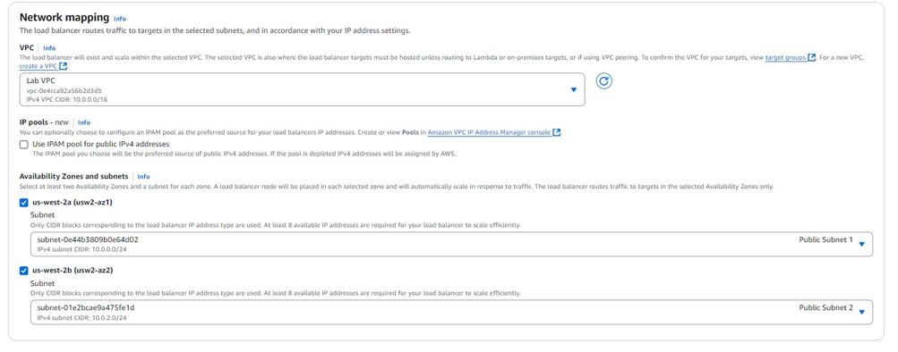
  
•	Select security group which you have to create and enable port 80 for http. 

•	At Listeners and routing section and click on create target group to create a target group. 

 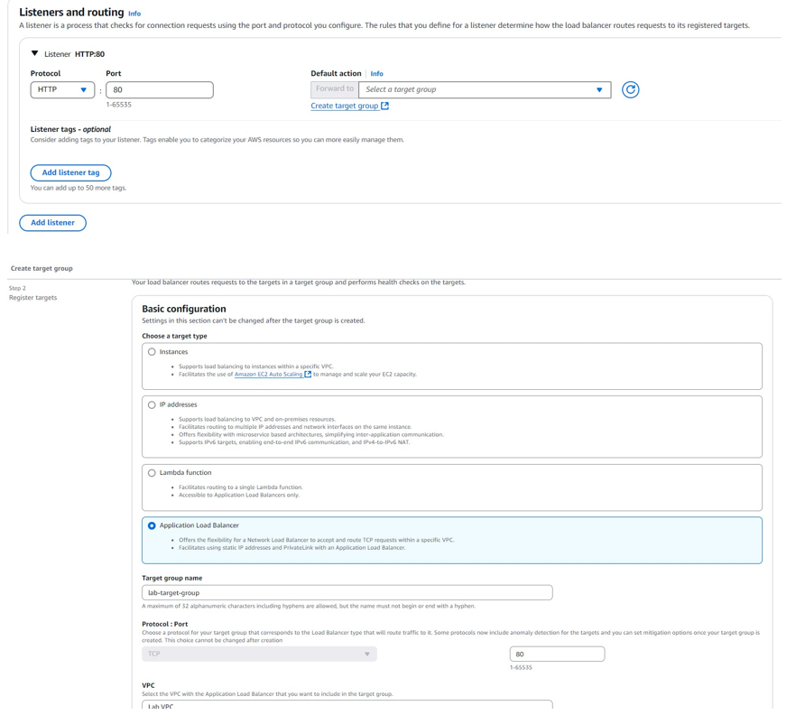 
   
•	Add instance to the target  

  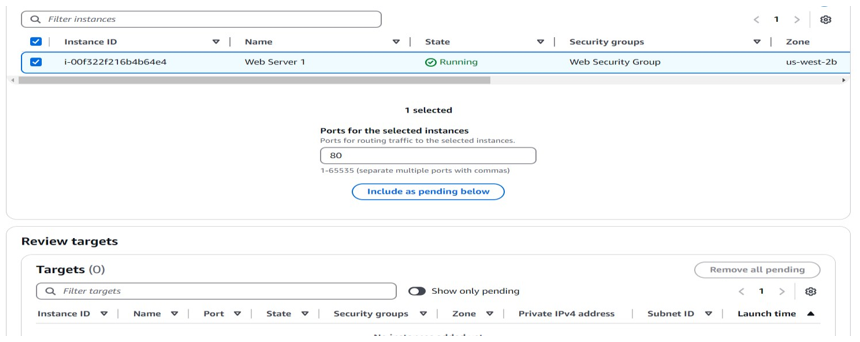
  
•	Add the target group in Listing and Routing 

  
 
•	We have successfully created load Balancer. 
 
3. Creating a launch template** 
•	create a launch template for your Auto Scaling group. A launch template is a template that an Auto Scaling group uses to launch EC2 instances. When you create a launch template, you specify information for the instances, such as the AMI, instance type, key pair, security group, and disks 
•	In the left navigation pane, locate the Instances section, and choose Launch Templates and create launch template 
  
•	For Auto Scaling guidance, choose Provide guidance to help me set up a template that I can use with EC2 Auto Scaling. 
•	In the Application and OS Images (Amazon Machine Image) - required section, choose the My AMIs tab. Notice that Web Server AMI and choose that AMI. 
•	In the Key pair (login) section, confirm that you create a key pair to log to instances in autoscaling group. 
  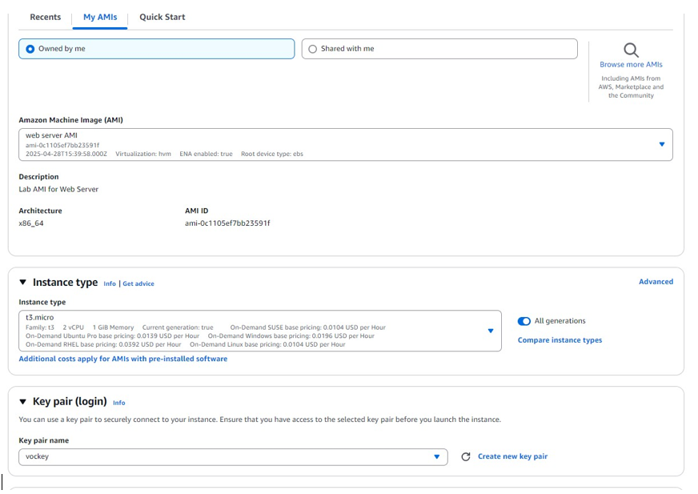
•	Click on launch template 
  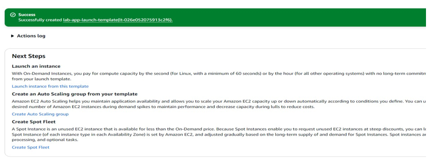
4. Creating an Auto Scaling group 
•	Choose lab-app-launch-template, and then from Actions dropdown list, choose Create 
Auto Scaling group 
  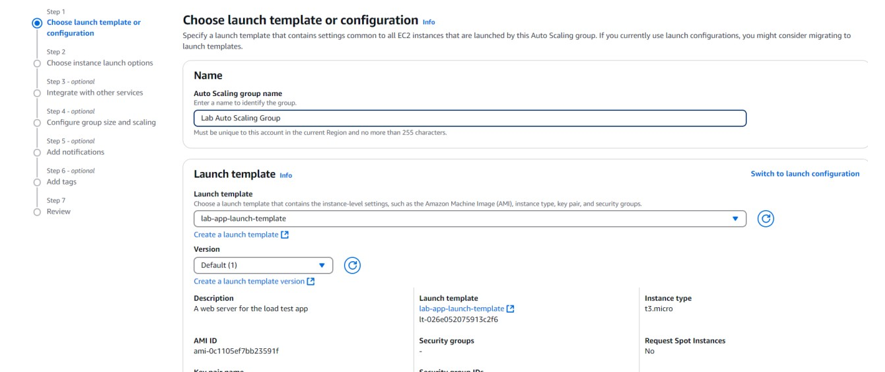
•	On the Choose instance launch options page, in the Network section, configure the VPC and SUBNETS 
  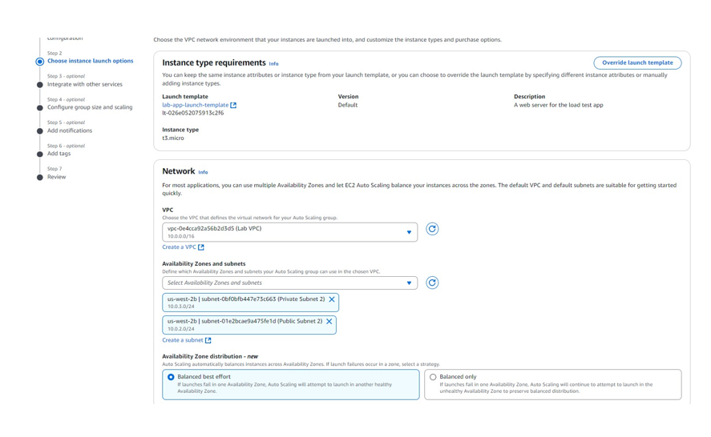
 
 
 
 
 
 
•	In the Integrate with other services – optional page choose existing load balancer which we have already created before. 
  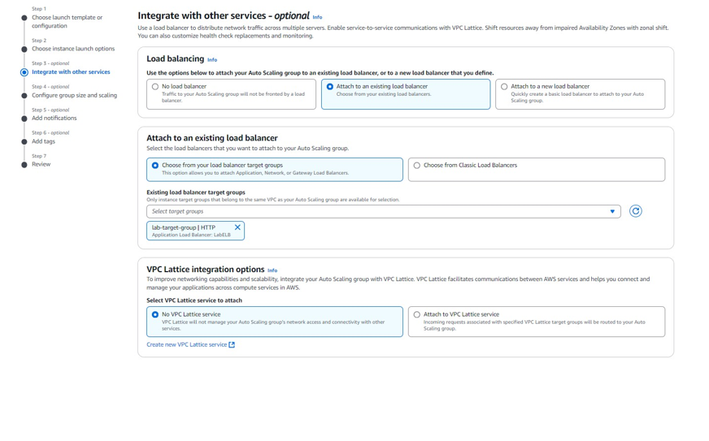
 
•	On the Configure group size and scaling policies – optional page  
•	In the Group size – optional section, enter the following values: Desired capacity:2, Minimum capacity: 2 Maximum capacity: 4 
•	In the Scaling policies – optional section, configure the following options: 
•	Choose Target tracking scaling policy. 
•	For Metric type, choose Average CPU utilization. 
• 	Change the Target value to 	50	 
• 	This change tells Auto Scaling to maintain an average CPU utilization across all 
instances of 50 percent. Auto Scaling automatically adds or removes capacity as required to keep the metric at or close to the specified target value. It adjusts to fluctuations in the metric due to a fluctuating load pattern. 
 
 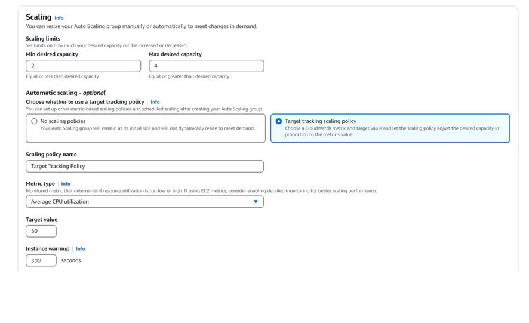
 
 
 
 
  
 
•	Add Notification: Send notifications to SNS topics whenever Amazon EC2 Auto Scaling launches or terminates the EC2 instances in your Auto Scaling group. 
  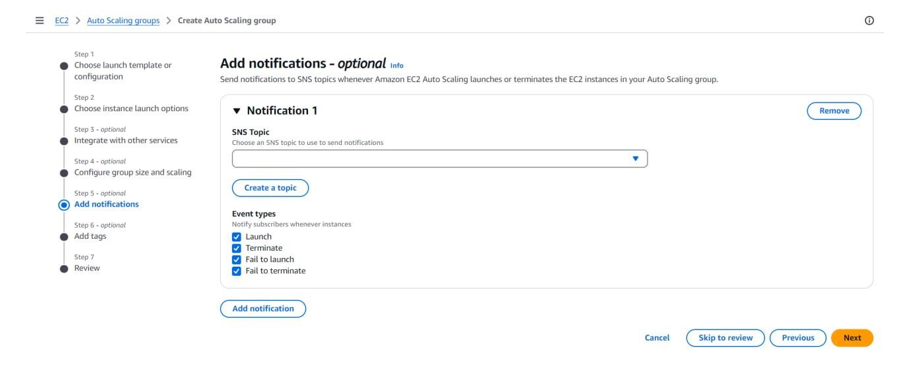
•	Create a topic 
  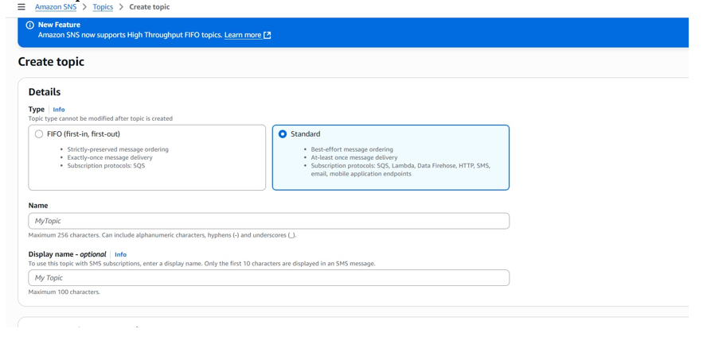
•	Review everything and choose create auto scaling group. 
  
•	In the left navigation pane, locate the Instances section, and choose Instances. 
•	You should see two new instances named Lab Instance. These instances were launched by auto scaling.  
  
•	Verifying that load balancing is working 
 
•	in the Load Balancing section, choose Target Groups. 
•	Choose lab-target-group which we have created. 
•	In the Registered targets section, two Lab Instance targets should be listed for this target group. 
•	Wait until the Health status of both instances changes to healthy. 
  
 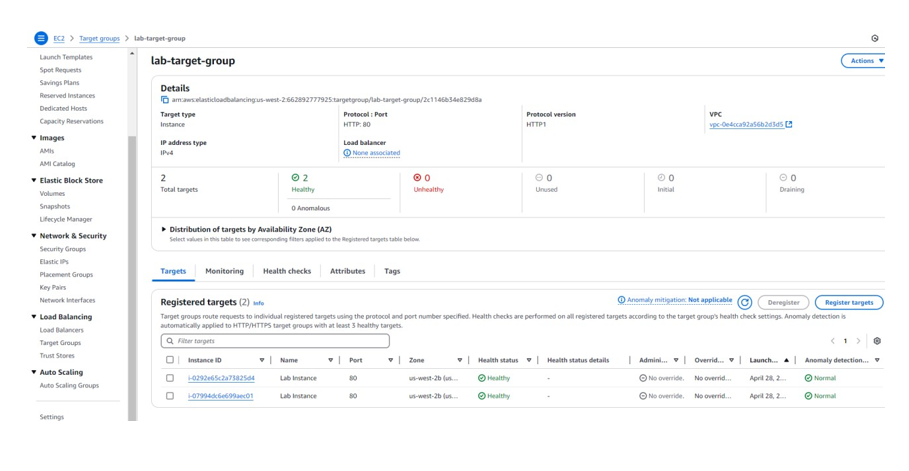
 
5. Verifying that load balancing is working 
•	You should see two new instances named Lab Instance. These instances were launched by auto scaling. 
  
•	Open a new web browser tab, paste the DNS name that you copied before, and press Enter. 
  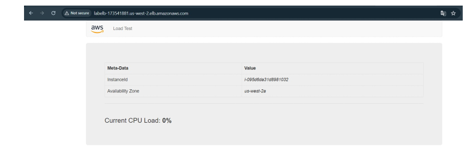
•	If we refresh website we can see change in availability zone 
  
 
6: Testing auto scaling 
•	In the AWS Management Console, in the search bar, enter and choose CloudWatch 
•	In the left navigation pane, in the Alarms section, choose All alarms. 
•	Two alarms are displayed. The Auto Scaling group automatically created these two alarms. These alarms automatically keep the average CPU load close to 50 percent while also staying within the limitation of having 2–4 instances. 
•	Choose the alarm that has AlarmHigh in its name. This alarm should have a State of OK. The OK state indicates that the alarm has not been initiated. It is the alarm for CPU Utilization > 50, which adds instances when the average CPU utilization is high. The chart should show very low levels of CPU at the moment. 
•	You should see the AlarmHigh chart indicating an increasing CPU percentage. Once it crosses the 50 percent line for more than 3 minutes, it initiates auto scaling to add additional instances. 
  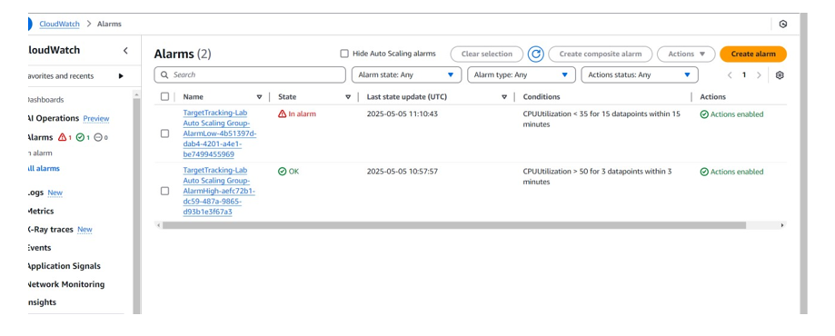
 
•	More than two instances named Lab Instance should now be running. Auto scaling created the new instances in response to the alarm. 
 
  
 
 
 

